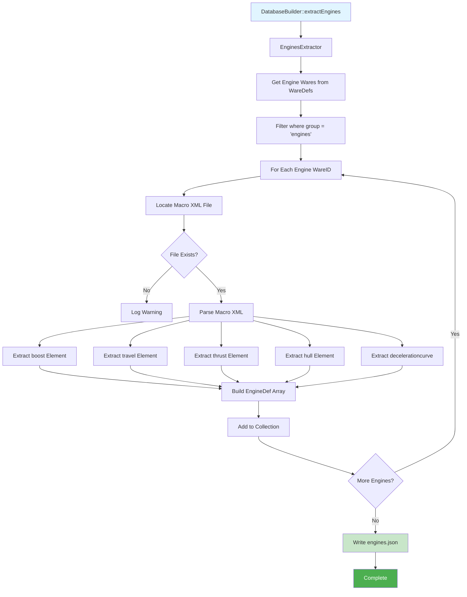

# Engine Metadata System - Implementation Plan

> **Created:** February 9, 2026  
> **Status:** Not Started  
> **Estimated Total Time:** 6-8 hours  
> **Dependencies:** x4-core project, x4-data-extractor with extracted game data

---

## 🎯 Project Overview

### Objective
Add detailed engine performance data to x4-core by creating a new `engines.json` data file that stores engine characteristics (thrust, boost, travel speed, hull, performance curves) linked to existing `wares.json` entries via wareID.

### Business Value
- Enable detailed engine comparison in UI
- Support advanced filtering by performance characteristics
- Provide foundation for ship loadout optimization features
- Complete equipment metadata beyond basic ware information

### Architectural Approach
Follow the established Collection-Item pattern used throughout x4-core:
- **EngineDef** (item) - Individual engine with all properties
- **EngineDefs** (collection) - Singleton managing all engines  
- **EngineFinder** (filter) - Query interface for filtering
- **EnginesExtractor** (builder) - Extracts data from X4 XML files

### Key Design Decisions

| Decision | Rationale |
|----------|-----------|
| **Separate engines.json** | Keep performance data isolated from basic ware info, follows existing pattern (modules.json, ships.json) |
| **Link via wareID** | Maintains existing ware system, adds stats on top without duplication |
| **All properties extracted** | Include boost, travel, thrust, hull, curves for maximum UI flexibility |
| **EngineFinder included** | Consistent with WaresFinder/ShipsFinder/ModulesFinder patterns |
| **Extract after wares** | Engines depend on WareDefs for filtering by group |
| **All DLCs supported** | Complete dataset matching other collections (vanilla + 7 expansions) |

### System Context

**Current State:**
- Engines exist in `wares.json` as basic ware entries (ID, label, size, tags)
- Performance data exists in X4 macro XML files but is **NOT extracted**
- Location: `x4-data-extractor/output/{datasource}/assets/props/Engines/macros/*.xml`

**After Implementation:**
- `data/engines.json` contains performance data for all engines across all DLCs
- `EngineDefs::getInstance()->getByID('engine_arg_l_allround_01_mk1')` returns full stats
- `EngineDefs::getInstance()->findEngines()->selectSize('l')->selectMakerRace('argon')->getAll()` filters engines
- Build process: `composer build` or `composer extract-engines`

### Engine Properties Available in XML

From macro XML files (example: `engine_arg_l_allround_01_mk1_macro.xml`):

```xml
<boost duration="27" recharge="92" thrust="6.89" acceleration="4.33" 
       attack="10" release="5" coast="1.2" />
<travel charge="20" thrust="30.53" attack="91" release="22.5" />
<thrust forward="3900" reverse="3705" />
<hull max="4033" threshold="0.3" />
<decelerationcurve>
  <point position="1.01" value="1" />
  <!-- more points -->
</decelerationcurve>
```

**Extractable Fields:**
- **Boost:** duration, recharge, thrust, acceleration, attack, release, coast (7 fields)
- **Travel:** charge, thrust, attack, release (4 fields)
- **Thrust:** forward, reverse (2 fields)
- **Hull:** max, threshold (2 fields)
- **Curves:** decelerationcurve points (array)
- **Metadata:** wareID, macroID, label, size, makerRace, mk, dataSourceID

### Required Manifest Updates

Per [AGENTS.md](../../AGENTS.md#manifest-maintenance-rules) change-to-document mapping:

| Manifest Document | Required Updates | Sections |
|-------------------|------------------|----------|
| [file-tree.md](../project-manifest/file-tree.md) | Add Engines/ folder under Database/ | `src/X4/Database/` |
| [public-api.md](../project-manifest/public-api.md) | Add Database\Engines namespace | New section with all public methods |
| [data-flows.md](../project-manifest/data-flows.md) | Add Engine Extraction Flow | New diagram showing XML → EngineDef → JSON |
| [tech-stack.md](../project-manifest/tech-stack.md) | Add engines.json as data file | Data Files section, Collection-Item examples |
| [constraints.md](../project-manifest/constraints.md) | No changes needed | Follows existing patterns |

---

## 📦 Work Package Breakdown

This plan is divided into **5 independent work packages** that can be implemented incrementally. Each package includes complete context for pickup without prior session knowledge.

### Package Dependencies

```
WP1 (EngineDef) ─┐
                 ├─> WP2 (EngineDefs) ─┐
                 │                      ├─> WP4 (Integration)
                 └─> WP3 (EngineFinder)─┘
                                        │
                                        └─> WP5 (Docs & Tests)
```

**Implementation Order:**
1. WP1 → WP2 → WP3 can be done in any order (no dependencies)
2. WP4 requires WP1, WP2, WP3 complete
3. WP5 requires WP4 complete

---

## 🔨 Work Package 1: EngineDef Item Class

**Status:** Not Started  
**Estimated Time:** 1.5 hours  
**Dependencies:** None  
**Assigned To:** Unassigned

### Goal
Create the item class representing a single engine with all performance properties.

### Context
- **Pattern:** Collection-Item (see [tech-stack.md](../project-manifest/tech-stack.md#collection-item-pattern))
- **Example:** Study `src/X4/Database/Modules/ModuleDef.php` for similar structure
- **Constraints:** [constraints.md](../project-manifest/constraints.md) - Immutable items, type declarations required

### Files to Create

#### `src/X4/Database/Engines/EngineDef.php`

**Class Structure:**
```php
<?php
namespace X4\Database\Engines;

use X4\Database\CollectionItemInterface;
use X4\Database\CollectionItemTrait;

/**
 * Represents a single engine with performance characteristics.
 * 
 * Links to WareDef via wareID for basic ware info (label, tags, price).
 * Stores engine-specific performance data extracted from X4 macro XML.
 */
class EngineDef implements CollectionItemInterface
{
    use CollectionItemTrait;
    
    // Core identification
    private string $wareID;      // Primary key, links to wares.json
    private string $macroID;     // Engine macro reference
    private string $label;       // Display name (from ware)
    private string $size;        // s/m/l/xl
    private string $dataSourceID; // vanilla/ego_dlc_split/etc
    private string $makerRace;   // argon/paranid/teladi/etc
    private int $mk;             // Mark level (1/2/3)
    
    // Boost properties (7 fields)
    private float $boostDuration;      // Boost duration in seconds
    private float $boostRecharge;      // Recharge time in seconds
    private float $boostThrust;        // Thrust multiplier during boost
    private float $boostAcceleration;  // Acceleration multiplier
    private float $boostAttack;        // Attack time (acceleration to boost)
    private float $boostRelease;       // Release time (deceleration from boost)
    private float $boostCoast;         // Coast factor
    
    // Travel drive properties (4 fields)
    private float $travelCharge;    // Charge time in seconds
    private float $travelThrust;    // Travel thrust value
    private float $travelAttack;    // Attack time
    private float $travelRelease;   // Release time
    
    // Standard thrust (2 fields)
    private float $thrustForward;   // Forward thrust
    private float $thrustReverse;   // Reverse thrust
    
    // Hull durability (2 fields)
    private float $hullMax;         // Maximum hull points
    private float $hullThreshold;   // Damage threshold
    
    // Performance curves (optional, may be empty)
    private array $decelerationCurve; // Array of ['position' => float, 'value' => float]
    
    // Constructor (private - use fromArray)
    private function __construct() {}
    
    // Static factory (required by pattern)
    public static function fromArray(array $data): self
    {
        $def = new self();
        
        // Core properties (required)
        $def->wareID = $data['wareID'];
        $def->macroID = $data['macroID'];
        $def->label = $data['label'];
        $def->size = $data['size'];
        $def->dataSourceID = $data['dataSourceID'];
        $def->makerRace = $data['makerRace'] ?? 'unknown';
        $def->mk = $data['mk'] ?? 1;
        
        // Boost properties (with defaults for missing data)
        $def->boostDuration = (float)($data['boostDuration'] ?? 0.0);
        $def->boostRecharge = (float)($data['boostRecharge'] ?? 0.0);
        $def->boostThrust = (float)($data['boostThrust'] ?? 1.0);
        $def->boostAcceleration = (float)($data['boostAcceleration'] ?? 1.0);
        $def->boostAttack = (float)($data['boostAttack'] ?? 0.0);
        $def->boostRelease = (float)($data['boostRelease'] ?? 0.0);
        $def->boostCoast = (float)($data['boostCoast'] ?? 1.0);
        
        // Travel properties
        $def->travelCharge = (float)($data['travelCharge'] ?? 0.0);
        $def->travelThrust = (float)($data['travelThrust'] ?? 0.0);
        $def->travelAttack = (float)($data['travelAttack'] ?? 0.0);
        $def->travelRelease = (float)($data['travelRelease'] ?? 0.0);
        
        // Thrust properties
        $def->thrustForward = (float)($data['thrustForward'] ?? 0.0);
        $def->thrustReverse = (float)($data['thrustReverse'] ?? 0.0);
        
        // Hull properties
        $def->hullMax = (float)($data['hullMax'] ?? 0.0);
        $def->hullThreshold = (float)($data['hullThreshold'] ?? 0.0);
        
        // Curves
        $def->decelerationCurve = $data['decelerationCurve'] ?? [];
        
        return $def;
    }
    
    // Serialization (required by pattern)
    public function toArray(): array
    {
        return [
            'wareID' => $this->wareID,
            'macroID' => $this->macroID,
            'label' => $this->label,
            'size' => $this->size,
            'dataSourceID' => $this->dataSourceID,
            'makerRace' => $this->makerRace,
            'mk' => $this->mk,
            
            'boostDuration' => $this->boostDuration,
            'boostRecharge' => $this->boostRecharge,
            'boostThrust' => $this->boostThrust,
            'boostAcceleration' => $this->boostAcceleration,
            'boostAttack' => $this->boostAttack,
            'boostRelease' => $this->boostRelease,
            'boostCoast' => $this->boostCoast,
            
            'travelCharge' => $this->travelCharge,
            'travelThrust' => $this->travelThrust,
            'travelAttack' => $this->travelAttack,
            'travelRelease' => $this->travelRelease,
            
            'thrustForward' => $this->thrustForward,
            'thrustReverse' => $this->thrustReverse,
            
            'hullMax' => $this->hullMax,
            'hullThreshold' => $this->hullThreshold,
            
            'decelerationCurve' => $this->decelerationCurve,
        ];
    }
    
    // Getters for CollectionItemInterface
    public function getID(): string { return $this->wareID; }
    public function getLabel(): string { return $this->label; }
    
    // Core property getters
    public function getWareID(): string { return $this->wareID; }
    public function getMacroID(): string { return $this->macroID; }
    public function getSize(): string { return $this->size; }
    public function getDataSourceID(): string { return $this->dataSourceID; }
    public function getMakerRace(): string { return $this->makerRace; }
    public function getMk(): int { return $this->mk; }
    
    // Boost getters
    public function getBoostDuration(): float { return $this->boostDuration; }
    public function getBoostRecharge(): float { return $this->boostRecharge; }
    public function getBoostThrust(): float { return $this->boostThrust; }
    public function getBoostAcceleration(): float { return $this->boostAcceleration; }
    public function getBoostAttack(): float { return $this->boostAttack; }
    public function getBoostRelease(): float { return $this->boostRelease; }
    public function getBoostCoast(): float { return $this->boostCoast; }
    
    // Travel getters
    public function getTravelCharge(): float { return $this->travelCharge; }
    public function getTravelThrust(): float { return $this->travelThrust; }
    public function getTravelAttack(): float { return $this->travelAttack; }
    public function getTravelRelease(): float { return $this->travelRelease; }
    
    // Thrust getters
    public function getThrustForward(): float { return $this->thrustForward; }
    public function getThrustReverse(): float { return $this->thrustReverse; }
    
    // Hull getters
    public function getHullMax(): float { return $this->hullMax; }
    public function getHullThreshold(): float { return $this->hullThreshold; }
    
    // Curve getters
    public function getDecelerationCurve(): array { return $this->decelerationCurve; }
    public function hasDecelerationCurve(): bool { return !empty($this->decelerationCurve); }
}
```

#### `src/X4/Database/Engines/EngineException.php`

**Class Structure:**
```php
<?php
namespace X4\Database\Engines;

use X4\Database\X4_Database_Exception;

class EngineException extends X4_Database_Exception
{
    public const ERROR_ENGINE_NOT_FOUND = 142001;
    public const ERROR_INVALID_ENGINE_SIZE = 142002;
    public const ERROR_INVALID_ENGINE_DATA = 142003;
}
```

### Implementation Steps

1. Create directory: `src/X4/Database/Engines/`
2. Create `EngineDef.php` with full class implementation above
3. Create `EngineException.php` with error constants
4. Verify PHP syntax: `php -l src/X4/Database/Engines/EngineDef.php`
5. Run PHPStan: `composer phpstan` (expect no errors)

### Verification Checklist

- [ ] File created at correct location following file-tree.md structure
- [ ] Implements `CollectionItemInterface` with required methods
- [ ] Uses `CollectionItemTrait` for common functionality
- [ ] All properties have type declarations
- [ ] `fromArray()` handles missing fields with defaults
- [ ] `toArray()` returns all properties for JSON serialization
- [ ] Getter methods follow naming convention (get* prefix)
- [ ] No setter methods (immutable after construction)
- [ ] PHPStan passes with no errors
- [ ] Exception class extends correct parent

### Reference Files
- Pattern: `src/X4/Database/Modules/ModuleDef.php`
- Interface: `src/X4/Database/CollectionItemInterface.php`
- Trait: `src/X4/Database/CollectionItemTrait.php`
- Parent exception: `src/X4/Database/X4_Database_Exception.php`

---

## 🔨 Work Package 2: EngineDefs Collection Class

**Status:** Not Started  
**Estimated Time:** 1 hour  
**Dependencies:** WP1 (EngineDef must exist)  
**Assigned To:** Unassigned

### Goal
Create the singleton collection class managing all engine instances, loading from `engines.json`.

### Context
- **Pattern:** Collection-Item (see [tech-stack.md](../project-manifest/tech-stack.md#collection-item-pattern))
- **Example:** Study `src/X4/Database/Modules/ModuleDefs.php` for structure
- **Data Source:** Will load from `data/engines.json` (created by extractor in WP4)

### Files to Create

#### `src/X4/Database/Engines/EngineDefs.php`

**Class Structure:**
```php
<?php
namespace X4\Database\Engines;

use X4\Database\BaseStringPrimaryCollection;
use X4\Database\ItemCollectionInterface;

/**
 * Collection of all engine definitions.
 * 
 * Singleton accessor for engine performance data loaded from engines.json.
 * Engines link to WareDefs via wareID.
 * 
 * Usage:
 *   $engine = EngineDefs::getInstance()->getByID('engine_arg_l_allround_01_mk1');
 *   $engines = EngineDefs::getInstance()->getAll();
 *   $finder = EngineDefs::getInstance()->findEngines();
 */
class EngineDefs extends BaseStringPrimaryCollection implements ItemCollectionInterface
{
    public const DATA_FILE = 'engines.json';
    public const ERROR_ENGINE_NOT_FOUND = EngineException::ERROR_ENGINE_NOT_FOUND;
    
    private static ?self $instance = null;
    
    /**
     * Get singleton instance.
     * Loads engines.json on first access.
     */
    public static function getInstance(): self
    {
        if (self::$instance === null) {
            self::$instance = new self();
        }
        return self::$instance;
    }
    
    /**
     * Private constructor enforces singleton pattern.
     */
    private function __construct()
    {
        parent::__construct();
    }
    
    /**
     * Get engine by ware ID.
     * 
     * @param string $wareID Engine ware ID (e.g., 'engine_arg_l_allround_01_mk1')
     * @return EngineDef
     * @throws EngineException If engine not found
     */
    public function getByID(string $wareID): EngineDef
    {
        $engine = $this->getItemByID($wareID);
        if ($engine === null) {
            throw new EngineException(
                sprintf('Engine not found: %s', $wareID),
                self::ERROR_ENGINE_NOT_FOUND
            );
        }
        return $engine;
    }
    
    /**
     * Check if engine exists.
     */
    public function idExists(string $wareID): bool
    {
        return $this->getItemByID($wareID) !== null;
    }
    
    /**
     * Get all engines.
     * 
     * @return EngineDef[]
     */
    public function getAll(): array
    {
        return $this->getItems();
    }
    
    /**
     * Get default engine ID (first in collection).
     */
    public function getDefaultID(): string
    {
        $engines = $this->getAll();
        if (empty($engines)) {
            throw new EngineException(
                'No engines available',
                self::ERROR_ENGINE_NOT_FOUND
            );
        }
        return $engines[0]->getID();
    }
    
    /**
     * Get default engine instance.
     */
    public function getDefault(): EngineDef
    {
        return $this->getByID($this->getDefaultID());
    }
    
    /**
     * Create finder for filtering engines.
     * 
     * @return EngineFinder
     */
    public function findEngines(): EngineFinder
    {
        return new EngineFinder($this->getAll());
    }
    
    /**
     * Load engines from JSON file.
     * Called automatically by parent constructor.
     */
    protected function registerItems(): void
    {
        $data = $this->getDataFile()->getData();
        
        foreach ($data as $engineData) {
            $this->registerItem(EngineDef::fromArray($engineData));
        }
    }
    
    /**
     * Get data file name.
     */
    public function getDataFileName(): string
    {
        return self::DATA_FILE;
    }
}
```

### Implementation Steps

1. Create `src/X4/Database/Engines/EngineDefs.php` with implementation above
2. Verify PHP syntax: `php -l src/X4/Database/Engines/EngineDefs.php`
3. Run PHPStan: `composer phpstan`
4. **Note:** Cannot fully test until `engines.json` exists (created in WP4)

### Verification Checklist

- [ ] Extends `BaseStringPrimaryCollection` correctly
- [ ] Implements `ItemCollectionInterface`
- [ ] Singleton pattern with private constructor
- [ ] `getInstance()` returns same instance on multiple calls
- [ ] `getByID()` throws `EngineException` for invalid IDs
- [ ] `getAll()` returns `EngineDef[]` array
- [ ] `findEngines()` returns `EngineFinder` instance
- [ ] `registerItems()` calls `EngineDef::fromArray()`
- [ ] PHPStan passes with no errors

### Reference Files
- Pattern: `src/X4/Database/Modules/ModuleDefs.php`
- Base class: `src/X4/Database/BaseStringPrimaryCollection.php`
- Interface: `src/X4/Database/ItemCollectionInterface.php`

### Testing Note
Full testing requires `data/engines.json` to exist. After WP4 completion:
```php
// Test basic access
$engines = EngineDefs::getInstance()->getAll();
echo count($engines);  // Should be ~150+

// Test lookup
$engine = EngineDefs::getInstance()->getByID('engine_arg_l_allround_01_mk1');
echo $engine->getThrustForward();
```

---

## 🔨 Work Package 3: EngineFinder Filter Class

**Status:** Not Started  
**Estimated Time:** 1.5 hours  
**Dependencies:** WP1 (EngineDef must exist)  
**Assigned To:** Unassigned

### Goal
Create the finder class for filtering engines by various criteria (size, race, performance).

### Context
- **Pattern:** Finder Pattern (see [tech-stack.md](../project-manifest/tech-stack.md#finder-pattern))
- **Example:** Study `src/X4/Database/Wares/WareFinder.php` for filter methods
- **Usage:** Fluent interface for chaining filters

### Files to Create

#### `src/X4/Database/Engines/EngineFinder.php`

**Class Structure:**
```php
<?php
namespace X4\Database\Engines;

use X4\Database\BaseFinder;

/**
 * Finder for filtering engine collections.
 * 
 * Provides fluent interface for filtering engines by:
 * - Physical properties (size, maker race)
 * - Data source (vanilla, DLCs)
 * - Performance characteristics (thrust, boost, travel)
 * - Quality (mark level)
 * 
 * Usage:
 *   $engines = EngineDefs::getInstance()->findEngines()
 *       ->selectSize('l')
 *       ->selectMakerRace('argon')
 *       ->selectMinThrust(3000)
 *       ->getAll();
 */
class EngineFinder extends BaseFinder
{
    /**
     * @var EngineDef[]
     */
    private array $engines;
    
    /**
     * @param EngineDef[] $engines Initial engine collection
     */
    public function __construct(array $engines)
    {
        $this->engines = $engines;
    }
    
    /**
     * Filter by engine size.
     * 
     * @param string $size Engine size: 's', 'm', 'l', 'xl'
     * @return self
     */
    public function selectSize(string $size): self
    {
        $this->engines = array_filter(
            $this->engines,
            fn(EngineDef $engine) => $engine->getSize() === $size
        );
        return $this;
    }
    
    /**
     * Filter by multiple sizes.
     * 
     * @param string[] $sizes Array of sizes
     * @return self
     */
    public function selectSizes(array $sizes): self
    {
        $this->engines = array_filter(
            $this->engines,
            fn(EngineDef $engine) => in_array($engine->getSize(), $sizes, true)
        );
        return $this;
    }
    
    /**
     * Filter by maker race.
     * 
     * @param string $race Race: 'argon', 'paranid', 'teladi', 'split', 'boron', 'terran', etc.
     * @return self
     */
    public function selectMakerRace(string $race): self
    {
        $this->engines = array_filter(
            $this->engines,
            fn(EngineDef $engine) => $engine->getMakerRace() === $race
        );
        return $this;
    }
    
    /**
     * Filter by data source.
     * 
     * @param string $dataSourceID Data source: 'vanilla', 'ego_dlc_split', etc.
     * @return self
     */
    public function selectDataSource(string $dataSourceID): self
    {
        $this->engines = array_filter(
            $this->engines,
            fn(EngineDef $engine) => $engine->getDataSourceID() === $dataSourceID
        );
        return $this;
    }
    
    /**
     * Filter by mark level.
     * 
     * @param int $mk Mark level (1, 2, 3)
     * @return self
     */
    public function selectMk(int $mk): self
    {
        $this->engines = array_filter(
            $this->engines,
            fn(EngineDef $engine) => $engine->getMk() === $mk
        );
        return $this;
    }
    
    /**
     * Filter by minimum mark level.
     * 
     * @param int $minMk Minimum mark level
     * @return self
     */
    public function selectMinMk(int $minMk): self
    {
        $this->engines = array_filter(
            $this->engines,
            fn(EngineDef $engine) => $engine->getMk() >= $minMk
        );
        return $this;
    }
    
    // ===== Performance Filters =====
    
    /**
     * Filter by minimum forward thrust.
     * 
     * @param float $minThrust Minimum forward thrust value
     * @return self
     */
    public function selectMinThrust(float $minThrust): self
    {
        $this->engines = array_filter(
            $this->engines,
            fn(EngineDef $engine) => $engine->getThrustForward() >= $minThrust
        );
        return $this;
    }
    
    /**
     * Filter by maximum forward thrust.
     * 
     * @param float $maxThrust Maximum forward thrust value
     * @return self
     */
    public function selectMaxThrust(float $maxThrust): self
    {
        $this->engines = array_filter(
            $this->engines,
            fn(EngineDef $engine) => $engine->getThrustForward() <= $maxThrust
        );
        return $this;
    }
    
    /**
     * Filter by minimum boost duration.
     * 
     * @param float $minDuration Minimum boost duration in seconds
     * @return self
     */
    public function selectMinBoostDuration(float $minDuration): self
    {
        $this->engines = array_filter(
            $this->engines,
            fn(EngineDef $engine) => $engine->getBoostDuration() >= $minDuration
        );
        return $this;
    }
    
    /**
     * Filter by maximum boost recharge time (faster recharge).
     * 
     * @param float $maxRecharge Maximum recharge time in seconds
     * @return self
     */
    public function selectMaxBoostRecharge(float $maxRecharge): self
    {
        $this->engines = array_filter(
            $this->engines,
            fn(EngineDef $engine) => $engine->getBoostRecharge() <= $maxRecharge
        );
        return $this;
    }
    
    /**
     * Filter by minimum boost thrust multiplier.
     * 
     * @param float $minMultiplier Minimum thrust multiplier
     * @return self
     */
    public function selectMinBoostThrust(float $minMultiplier): self
    {
        $this->engines = array_filter(
            $this->engines,
            fn(EngineDef $engine) => $engine->getBoostThrust() >= $minMultiplier
        );
        return $this;
    }
    
    /**
     * Filter by minimum travel thrust.
     * 
     * @param float $minTravel Minimum travel thrust value
     * @return self
     */
    public function selectMinTravelThrust(float $minTravel): self
    {
        $this->engines = array_filter(
            $this->engines,
            fn(EngineDef $engine) => $engine->getTravelThrust() >= $minTravel
        );
        return $this;
    }
    
    /**
     * Filter by maximum travel charge time (faster charge).
     * 
     * @param float $maxCharge Maximum charge time in seconds
     * @return self
     */
    public function selectMaxTravelCharge(float $maxCharge): self
    {
        $this->engines = array_filter(
            $this->engines,
            fn(EngineDef $engine) => $engine->getTravelCharge() <= $maxCharge
        );
        return $this;
    }
    
    /**
     * Filter by minimum hull durability.
     * 
     * @param float $minHull Minimum hull max value
     * @return self
     */
    public function selectMinHull(float $minHull): self
    {
        $this->engines = array_filter(
            $this->engines,
            fn(EngineDef $engine) => $engine->getHullMax() >= $minHull
        );
        return $this;
    }
    
    /**
     * Filter engines with deceleration curves.
     * 
     * @return self
     */
    public function selectWithDecelerationCurve(): self
    {
        $this->engines = array_filter(
            $this->engines,
            fn(EngineDef $engine) => $engine->hasDecelerationCurve()
        );
        return $this;
    }
    
    // ===== Result Methods =====
    
    /**
     * Get all filtered engines.
     * 
     * @return EngineDef[]
     */
    public function getAll(): array
    {
        return array_values($this->engines);
    }
    
    /**
     * Get first filtered engine or null.
     * 
     * @return EngineDef|null
     */
    public function getFirst(): ?EngineDef
    {
        $engines = $this->getAll();
        return $engines[0] ?? null;
    }
    
    /**
     * Get count of filtered engines.
     * 
     * @return int
     */
    public function count(): int
    {
        return count($this->engines);
    }
    
    /**
     * Check if any engines match filters.
     * 
     * @return bool
     */
    public function hasResults(): bool
    {
        return $this->count() > 0;
    }
}
```

### Implementation Steps

1. Create `src/X4/Database/Engines/EngineFinder.php` with implementation above
2. Verify PHP syntax: `php -l src/X4/Database/Engines/EngineFinder.php`
3. Run PHPStan: `composer phpstan`
4. **Note:** Cannot fully test until `engines.json` exists (created in WP4)

### Verification Checklist

- [ ] Extends `BaseFinder` correctly
- [ ] Constructor accepts `EngineDef[]` array
- [ ] All filter methods return `self` for chaining
- [ ] Filter methods use `array_filter` with callbacks
- [ ] `getAll()` returns `EngineDef[]` array (re-indexed)
- [ ] `getFirst()` returns `EngineDef|null`
- [ ] `count()` and `hasResults()` work correctly
- [ ] PHPStan passes with no errors
- [ ] All methods have proper type declarations and PHPDoc

### Reference Files
- Pattern: `src/X4/Database/Wares/WareFinder.php`
- Pattern: `src/X4/Database/Ships/ShipFinder.php`
- Base class: `src/X4/Database/BaseFinder.php`

### Testing Note
After WP4 completion, test filter chaining:
```php
// Test chaining
$engines = EngineDefs::getInstance()->findEngines()
    ->selectSize('l')
    ->selectMakerRace('argon')
    ->selectMinThrust(3000)
    ->selectMinMk(2)
    ->getAll();

// Test performance filters
$fastEngines = EngineDefs::getInstance()->findEngines()
    ->selectMinBoostDuration(25)
    ->selectMaxBoostRecharge(100)
    ->getAll();
```

---

## 🔨 Work Package 4: EnginesExtractor & Integration

**Status:** Not Started  
**Estimated Time:** 2.5 hours  
**Dependencies:** WP1, WP2, WP3 (All classes must exist)  
**Assigned To:** Unassigned

### Goal
Create the extractor to parse X4 XML macro files and generate `engines.json`, then integrate into build process.

### Context
- **Pattern:** Extraction-Builder (see [tech-stack.md](../project-manifest/tech-stack.md#extraction-builder-pattern))
- **Example:** Study `src/X4/Database/Modules/ModulesExtractor.php` for XML parsing
- **Data Source:** X4 macro XML files in `x4-data-extractor/output/{datasource}/assets/props/Engines/macros/`

### Data Extraction Details

**Source Files:**
```
x4-data-extractor/output/
├── vanilla/assets/props/Engines/macros/*.xml
├── ego_dlc_boron/assets/props/Engines/macros/*.xml
├── ego_dlc_split/assets/props/Engines/macros/*.xml
├── ego_dlc_terran/assets/props/Engines/macros/*.xml
├── ego_dlc_pirate/assets/props/Engines/macros/*.xml
├── ego_dlc_timelines/assets/props/Engines/macros/*.xml
├── ego_dlc_mini_01/assets/props/Engines/macros/*.xml
└── ego_dlc_mini_02/assets/props/Engines/macros/*.xml
```

**XML Structure to Parse:**
```xml
<?xml version="1.0" encoding="utf-8"?>
<macros>
  <macro name="engine_arg_l_allround_01_mk1_macro" class="engine">
    <properties>
      <identification name="{20107,3004}" basename="{20107,3001}" 
                      makerrace="argon" mk="1" />
      <boost duration="27" recharge="92" thrust="6.89" 
             acceleration="4.33" attack="10" release="5" coast="1.2" />
      <travel charge="20" thrust="30.53" attack="91" release="22.5" />
      <thrust forward="3900" reverse="3705" />
      <hull max="4033" threshold="0.3" />
      <decelerationcurve>
        <point position="1.01" value="1" />
        <point position="4.2" value="0.25" />
        <!-- more points -->
      </decelerationcurve>
    </properties>
  </macro>
</macros>
```

### Files to Create

#### `src/X4/Database/Engines/EnginesExtractor.php`

**Class Structure (Implementation Guide):**

```php
<?php
namespace X4\Database\Engines;

use X4\Database\Wares\WareDefs;
use X4\Database\Wares\WareDef;
use X4\Database\DataFolders\DataFolders;
use X4\Database\DataFolders\DataFolder;
use X4\XML\DOMHelper;
use DOMDocument;
use DOMXPath;

/**
 * Extracts engine performance data from X4 macro XML files.
 * 
 * Process:
 * 1. Filter WareDefs to get only engines (group = "engines")
 * 2. For each engine wareID:
 *    - Locate macro XML file via macroID
 *    - Parse performance properties from XML
 *    - Build EngineDef data array
 * 3. Write to data/engines.json
 */
class EnginesExtractor
{
    private DataFolders $dataFolders;
    private array $engines = [];
    
    public function __construct(DataFolders $dataFolders)
    {
        $this->dataFolders = $dataFolders;
    }
    
    /**
     * Main extraction method.
     * Generates data/engines.json.
     */
    public function extract(): void
    {
        echo "Extracting engine data...\n";
        
        // Step 1: Get all engine wares
        $engineWares = $this->getEngineWares();
        echo sprintf("Found %d engine wares\n", count($engineWares));
        
        // Step 2: Extract performance data for each engine
        foreach ($engineWares as $ware) {
            $this->extractEngineData($ware);
        }
        
        echo sprintf("Extracted %d engines\n", count($this->engines));
        
        // Step 3: Write to JSON
        $this->writeJSON();
        echo "Engine extraction complete!\n";
    }
    
    /**
     * Get all engine ware entries from WareDefs.
     * 
     * @return WareDef[]
     */
    private function getEngineWares(): array
    {
        $wares = WareDefs::getInstance()->getAll();
        
        return array_filter($wares, function(WareDef $ware) {
            return $ware->getGroup() === 'engines';
        });
    }
    
    /**
     * Extract performance data for one engine.
     */
    private function extractEngineData(WareDef $ware): void
    {
        $wareID = $ware->getID();
        $macroID = $ware->getMacroID();
        
        // Find macro file
        $macroFile = $this->findMacroFile($macroID, $ware->getDataSourceID());
        if ($macroFile === null) {
            echo "  WARNING: Macro file not found for {$wareID}\n";
            return;
        }
        
        // Parse macro XML
        $macroData = $this->parseMacroXML($macroFile);
        if ($macroData === null) {
            echo "  WARNING: Failed to parse macro for {$wareID}\n";
            return;
        }
        
        // Build engine data array
        $engineData = [
            'wareID' => $wareID,
            'macroID' => $macroID,
            'label' => $ware->getLabel(),
            'size' => $ware->getSize(),
            'dataSourceID' => $ware->getDataSourceID(),
            'makerRace' => $macroData['makerRace'] ?? 'unknown',
            'mk' => $macroData['mk'] ?? 1,
            
            // Boost properties
            'boostDuration' => $macroData['boostDuration'] ?? 0.0,
            'boostRecharge' => $macroData['boostRecharge'] ?? 0.0,
            'boostThrust' => $macroData['boostThrust'] ?? 1.0,
            'boostAcceleration' => $macroData['boostAcceleration'] ?? 1.0,
            'boostAttack' => $macroData['boostAttack'] ?? 0.0,
            'boostRelease' => $macroData['boostRelease'] ?? 0.0,
            'boostCoast' => $macroData['boostCoast'] ?? 1.0,
            
            // Travel properties
            'travelCharge' => $macroData['travelCharge'] ?? 0.0,
            'travelThrust' => $macroData['travelThrust'] ?? 0.0,
            'travelAttack' => $macroData['travelAttack'] ?? 0.0,
            'travelRelease' => $macroData['travelRelease'] ?? 0.0,
            
            // Thrust properties
            'thrustForward' => $macroData['thrustForward'] ?? 0.0,
            'thrustReverse' => $macroData['thrustReverse'] ?? 0.0,
            
            // Hull properties
            'hullMax' => $macroData['hullMax'] ?? 0.0,
            'hullThreshold' => $macroData['hullThreshold'] ?? 0.0,
            
            // Curves
            'decelerationCurve' => $macroData['decelerationCurve'] ?? [],
        ];
        
        $this->engines[] = $engineData;
    }
    
    /**
     * Find macro XML file for engine.
     * 
     * @param string $macroID Engine macro ID
     * @param string $dataSourceID Data source (vanilla/DLC)
     * @return string|null Full path to macro file or null if not found
     */
    private function findMacroFile(string $macroID, string $dataSourceID): ?string
    {
        $dataFolder = $this->dataFolders->getByID($dataSourceID);
        
        // Standard path: assets/props/Engines/macros/{macroID}.xml
        $path = sprintf(
            '%s/assets/props/Engines/macros/%s.xml',
            $dataFolder->getPath(),
            $macroID
        );
        
        if (file_exists($path)) {
            return $path;
        }
        
        return null;
    }
    
    /**
     * Parse macro XML file to extract performance data.
     * 
     * @param string $filePath Path to macro XML file
     * @return array|null Associative array of properties or null on error
     */
    private function parseMacroXML(string $filePath): ?array
    {
        $doc = new DOMDocument();
        if (!@$doc->load($filePath)) {
            return null;
        }
        
        $xpath = new DOMXPath($doc);
        $data = [];
        
        // Get <properties> element
        $properties = $xpath->query('//macro/properties')->item(0);
        if (!$properties) {
            return null;
        }
        
        // Parse <identification> for makerrace and mk
        $identification = $xpath->query('identification', $properties)->item(0);
        if ($identification) {
            $data['makerRace'] = $identification->getAttribute('makerrace');
            $data['mk'] = (int)$identification->getAttribute('mk') ?: 1;
        }
        
        // Parse <boost> element
        $boost = $xpath->query('boost', $properties)->item(0);
        if ($boost) {
            $data['boostDuration'] = (float)$boost->getAttribute('duration');
            $data['boostRecharge'] = (float)$boost->getAttribute('recharge');
            $data['boostThrust'] = (float)$boost->getAttribute('thrust');
            $data['boostAcceleration'] = (float)$boost->getAttribute('acceleration');
            $data['boostAttack'] = (float)$boost->getAttribute('attack');
            $data['boostRelease'] = (float)$boost->getAttribute('release');
            $data['boostCoast'] = (float)$boost->getAttribute('coast');
        }
        
        // Parse <travel> element
        $travel = $xpath->query('travel', $properties)->item(0);
        if ($travel) {
            $data['travelCharge'] = (float)$travel->getAttribute('charge');
            $data['travelThrust'] = (float)$travel->getAttribute('thrust');
            $data['travelAttack'] = (float)$travel->getAttribute('attack');
            $data['travelRelease'] = (float)$travel->getAttribute('release');
        }
        
        // Parse <thrust> element
        $thrust = $xpath->query('thrust', $properties)->item(0);
        if ($thrust) {
            $data['thrustForward'] = (float)$thrust->getAttribute('forward');
            $data['thrustReverse'] = (float)$thrust->getAttribute('reverse');
        }
        
        // Parse <hull> element
        $hull = $xpath->query('hull', $properties)->item(0);
        if ($hull) {
            $data['hullMax'] = (float)$hull->getAttribute('max');
            $data['hullThreshold'] = (float)$hull->getAttribute('threshold');
        }
        
        // Parse <decelerationcurve> points
        $curve = $xpath->query('decelerationcurve', $properties)->item(0);
        if ($curve) {
            $points = [];
            $pointNodes = $xpath->query('point', $curve);
            foreach ($pointNodes as $pointNode) {
                $points[] = [
                    'position' => (float)$pointNode->getAttribute('position'),
                    'value' => (float)$pointNode->getAttribute('value'),
                ];
            }
            $data['decelerationCurve'] = $points;
        }
        
        return $data;
    }
    
    /**
     * Write engines array to JSON file.
     */
    private function writeJSON(): void
    {
        $jsonPath = __DIR__ . '/../../../data/engines.json';
        
        $json = json_encode($this->engines, JSON_PRETTY_PRINT | JSON_UNESCAPED_SLASHES);
        
        if (file_put_contents($jsonPath, $json) === false) {
            throw new EngineException(
                'Failed to write engines.json',
                EngineException::ERROR_INVALID_ENGINE_DATA
            );
        }
    }
}
```

### Files to Modify

#### `src/X4/Database/DatabaseBuilder.php`

**Location:** Find the `build()` method and `extract*()` methods.

**Change 1: Add extractEngines() method**

Add this new static method (anywhere near the other extract methods):

```php
/**
 * Extract engine performance data from macro XML files.
 * Generates data/engines.json.
 */
public static function extractEngines(): void
{
    self::init();
    
    echo "=== Extracting Engines ===\n";
    $extractor = new \X4\Database\Engines\EnginesExtractor(self::getDataFolders());
    $extractor->extract();
}
```

**Change 2: Add to build() method**

Find the `build()` method and add the engines extraction call after wares:

```php
public static function build(): void
{
    self::init();
    
    // ... existing extractions ...
    self::extractMacroIndex();
    self::extractTranslations();
    self::extractDataSources();
    self::extractFactions();
    self::extractWares();
    
    // ADD THIS LINE:
    self::extractEngines();  // Must come after extractWares()
    
    // ... rest of build process ...
    self::extractModules();
    self::extractBlueprints();
    self::extractShips();
}
```

#### `composer.json`

**Location:** Find the `"scripts"` section.

**Change: Add extract-engines command**

Add this line to the scripts section:

```json
{
  "scripts": {
    "build": "X4\\Database\\DatabaseBuilder::build",
    "extract-engines": "X4\\Database\\DatabaseBuilder::extractEngines",
    "extract-wares": "X4\\Database\\DatabaseBuilder::extractWares",
    // ... other scripts ...
  }
}
```

### Implementation Steps

1. Create `src/X4/Database/Engines/EnginesExtractor.php` with full implementation
2. Modify `src/X4/Database/DatabaseBuilder.php` (add method + call)
3. Modify `composer.json` (add script)
4. Verify PHP syntax: `php -l src/X4/Database/Engines/EnginesExtractor.php`
5. Run PHPStan: `composer phpstan`
6. **Run extraction:** `composer extract-engines`
7. **Verify output:** Check `data/engines.json` was created
8. **Run full build:** `composer build` (should include engines)

### Verification Checklist

- [ ] `EnginesExtractor.php` created with complete implementation
- [ ] `DatabaseBuilder::extractEngines()` method added
- [ ] `DatabaseBuilder::build()` calls `extractEngines()` after wares
- [ ] `composer.json` has `extract-engines` script
- [ ] PHPStan passes with no errors
- [ ] `composer extract-engines` runs without errors
- [ ] `data/engines.json` file exists and is valid JSON
- [ ] engines.json contains ~150+ entries
- [ ] engines.json entries have all required properties
- [ ] All DLCs included (check dataSourceID values)
- [ ] `composer build` includes engine extraction
- [ ] No warnings about missing macro files (or acceptable count)

### Testing Commands

```powershell
# Test individual extraction
composer extract-engines

# Check output
cat data/engines.json | ConvertFrom-Json | Measure-Object

# Test specific engine lookup
php -r "require 'vendor/autoload.php'; 
    \$e = \X4\Database\Engines\EngineDefs::getInstance()->getByID('engine_arg_l_allround_01_mk1');
    echo \$e->getThrustForward();"

# Test full build
composer build
```

### Expected Output Sample

`data/engines.json` should look like:

```json
[
  {
    "wareID": "engine_arg_l_allround_01_mk1",
    "macroID": "engine_arg_l_allround_01_mk1_macro",
    "label": "ARG L Allround Engine Mk1",
    "size": "l",
    "dataSourceID": "vanilla",
    "makerRace": "argon",
    "mk": 1,
    "boostDuration": 27,
    "boostRecharge": 92,
    "boostThrust": 6.89,
    "boostAcceleration": 4.33,
    "boostAttack": 10,
    "boostRelease": 5,
    "boostCoast": 1.2,
    "travelCharge": 20,
    "travelThrust": 30.53,
    "travelAttack": 91,
    "travelRelease": 22.5,
    "thrustForward": 3900,
    "thrustReverse": 3705,
    "hullMax": 4033,
    "hullThreshold": 0.3,
    "decelerationCurve": [
      {"position": 1.01, "value": 1},
      {"position": 4.2, "value": 0.25}
    ]
  }
]
```

### Troubleshooting

**Issue:** Macro files not found
- **Check:** Verify x4-data-extractor has extracted all DLCs
- **Check:** Run `composer unpack-all` in x4-data-extractor first
- **Solution:** Path format may vary, adjust `findMacroFile()` logic

**Issue:** Missing properties in XML
- **Expected:** Some engines may lack certain elements (travel, curves)
- **Solution:** Defaults in `fromArray()` handle this

**Issue:** Encoding errors in XML
- **Solution:** Use `@` suppressor on `$doc->load()` for malformed files

### Reference Files
- Pattern: `src/X4/Database/Modules/ModulesExtractor.php`
- XML utility: `src/X4/XML/DOMHelper.php`
- WareDefs access: `src/X4/Database/Wares/WareDefs.php`

---

## 🔨 Work Package 5: Documentation & Tests

**Status:** Not Started  
**Estimated Time:** 1.5 hours  
**Dependencies:** WP4 (Full system must be functional)  
**Assigned To:** Unassigned

### Goal
Update project manifest documentation and create comprehensive unit tests.

### Context
Per [AGENTS.md maintenance rules](../../AGENTS.md#manifest-maintenance-rules), manifest must be updated when adding new collections.

### Files to Create

#### Unit Tests Directory Structure

```
tests/X4Tests/Suites/Engines/
├── EngineDefTest.php       (Test EngineDef class)
├── EngineDefsTest.php      (Test EngineDefs collection)
├── EngineFinderTest.php    (Test filtering)
└── EnginesExtractorTest.php (Test extraction - optional)
```

#### `tests/X4Tests/Suites/Engines/EngineDefTest.php`

```php
<?php
namespace X4Tests\Suites\Engines;

use PHPUnit\Framework\TestCase;
use X4\Database\Engines\EngineDef;

class EngineDefTest extends TestCase
{
    private array $sampleData;
    
    protected function setUp(): void
    {
        $this->sampleData = [
            'wareID' => 'engine_test_l_01',
            'macroID' => 'engine_test_l_01_macro',
            'label' => 'Test Engine L',
            'size' => 'l',
            'dataSourceID' => 'vanilla',
            'makerRace' => 'argon',
            'mk' => 2,
            'boostDuration' => 25.0,
            'boostRecharge' => 90.0,
            'boostThrust' => 7.5,
            'boostAcceleration' => 5.0,
            'boostAttack' => 12.0,
            'boostRelease' => 6.0,
            'boostCoast' => 1.1,
            'travelCharge' => 18.0,
            'travelThrust' => 32.0,
            'travelAttack' => 95.0,
            'travelRelease' => 24.0,
            'thrustForward' => 4200.0,
            'thrustReverse' => 3900.0,
            'hullMax' => 4500.0,
            'hullThreshold' => 0.35,
            'decelerationCurve' => [
                ['position' => 1.0, 'value' => 1.0],
                ['position' => 2.0, 'value' => 0.5],
            ],
        ];
    }
    
    public function test_fromArray_createsInstance(): void
    {
        $engine = EngineDef::fromArray($this->sampleData);
        
        $this->assertInstanceOf(EngineDef::class, $engine);
        $this->assertEquals('engine_test_l_01', $engine->getID());
    }
    
    public function test_getters_returnCorrectValues(): void
    {
        $engine = EngineDef::fromArray($this->sampleData);
        
        $this->assertEquals('engine_test_l_01', $engine->getWareID());
        $this->assertEquals('engine_test_l_01_macro', $engine->getMacroID());
        $this->assertEquals('Test Engine L', $engine->getLabel());
        $this->assertEquals('l', $engine->getSize());
        $this->assertEquals('argon', $engine->getMakerRace());
        $this->assertEquals(2, $engine->getMk());
        
        // Boost
        $this->assertEquals(25.0, $engine->getBoostDuration());
        $this->assertEquals(90.0, $engine->getBoostRecharge());
        $this->assertEquals(7.5, $engine->getBoostThrust());
        
        // Travel
        $this->assertEquals(18.0, $engine->getTravelCharge());
        $this->assertEquals(32.0, $engine->getTravelThrust());
        
        // Thrust
        $this->assertEquals(4200.0, $engine->getThrustForward());
        $this->assertEquals(3900.0, $engine->getThrustReverse());
        
        // Hull
        $this->assertEquals(4500.0, $engine->getHullMax());
    }
    
    public function test_toArray_returnsAllData(): void
    {
        $engine = EngineDef::fromArray($this->sampleData);
        $array = $engine->toArray();
        
        $this->assertEquals($this->sampleData, $array);
    }
    
    public function test_fromArray_handlesDefaults(): void
    {
        $minimalData = [
            'wareID' => 'engine_minimal',
            'macroID' => 'engine_minimal_macro',
            'label' => 'Minimal Engine',
            'size' => 's',
            'dataSourceID' => 'vanilla',
        ];
        
        $engine = EngineDef::fromArray($minimalData);
        
        $this->assertEquals(0.0, $engine->getBoostDuration());
        $this->assertEquals(0.0, $engine->getThrustForward());
        $this->assertEquals('unknown', $engine->getMakerRace());
        $this->assertEquals(1, $engine->getMk());
    }
    
    public function test_hasDecelerationCurve(): void
    {
        $engine = EngineDef::fromArray($this->sampleData);
        $this->assertTrue($engine->hasDecelerationCurve());
        
        $noCurve = EngineDef::fromArray([
            'wareID' => 'test',
            'macroID' => 'test_macro',
            'label' => 'Test',
            'size' => 's',
            'dataSourceID' => 'vanilla',
        ]);
        $this->assertFalse($noCurve->hasDecelerationCurve());
    }
}
```

#### `tests/X4Tests/Suites/Engines/EngineDefsTest.php`

```php
<?php
namespace X4Tests\Suites\Engines;

use PHPUnit\Framework\TestCase;
use X4\Database\Engines\EngineDefs;
use X4\Database\Engines\EngineDef;
use X4\Database\Engines\EngineException;

class EngineDefsTest extends TestCase
{
    public function test_getInstance_returnsSingleton(): void
    {
        $instance1 = EngineDefs::getInstance();
        $instance2 = EngineDefs::getInstance();
        
        $this->assertSame($instance1, $instance2);
    }
    
    public function test_getAll_returnsArray(): void
    {
        $engines = EngineDefs::getInstance()->getAll();
        
        $this->assertIsArray($engines);
        $this->assertNotEmpty($engines);
        $this->assertContainsOnlyInstancesOf(EngineDef::class, $engines);
    }
    
    public function test_getByID_returnsEngine(): void
    {
        $engines = EngineDefs::getInstance()->getAll();
        $firstEngine = $engines[0];
        
        $engine = EngineDefs::getInstance()->getByID($firstEngine->getID());
        
        $this->assertInstanceOf(EngineDef::class, $engine);
        $this->assertEquals($firstEngine->getID(), $engine->getID());
    }
    
    public function test_getByID_throwsExceptionForInvalidID(): void
    {
        $this->expectException(EngineException::class);
        $this->expectExceptionCode(EngineException::ERROR_ENGINE_NOT_FOUND);
        
        EngineDefs::getInstance()->getByID('nonexistent_engine');
    }
    
    public function test_idExists_returnsCorrectValues(): void
    {
        $engines = EngineDefs::getInstance()->getAll();
        $validID = $engines[0]->getID();
        
        $this->assertTrue(EngineDefs::getInstance()->idExists($validID));
        $this->assertFalse(EngineDefs::getInstance()->idExists('nonexistent_engine'));
    }
    
    public function test_getDefault_returnsEngine(): void
    {
        $default = EngineDefs::getInstance()->getDefault();
        
        $this->assertInstanceOf(EngineDef::class, $default);
    }
    
    public function test_findEngines_returnsFinder(): void
    {
        $finder = EngineDefs::getInstance()->findEngines();
        
        $this->assertInstanceOf(\X4\Database\Engines\EngineFinder::class, $finder);
    }
    
    public function test_loadedEnginesHaveValidData(): void
    {
        $engines = EngineDefs::getInstance()->getAll();
        
        foreach ($engines as $engine) {
            $this->assertNotEmpty($engine->getWareID());
            $this->assertNotEmpty($engine->getLabel());
            $this->assertContains($engine->getSize(), ['s', 'm', 'l', 'xl']);
            $this->assertGreaterThanOrEqual(0, $engine->getThrustForward());
        }
    }
}
```

#### `tests/X4Tests/Suites/Engines/EngineFinderTest.php`

```php
<?php
namespace X4Tests\Suites\Engines;

use PHPUnit\Framework\TestCase;
use X4\Database\Engines\EngineDefs;
use X4\Database\Engines\EngineFinder;
use X4\Database\Engines\EngineDef;

class EngineFinderTest extends TestCase
{
    public function test_getAll_returnsAllEngines(): void
    {
        $finder = EngineDefs::getInstance()->findEngines();
        $engines = $finder->getAll();
        
        $this->assertIsArray($engines);
        $this->assertContainsOnlyInstancesOf(EngineDef::class, $engines);
    }
    
    public function test_selectSize_filtersCorrectly(): void
    {
        $engines = EngineDefs::getInstance()->findEngines()
            ->selectSize('l')
            ->getAll();
        
        foreach ($engines as $engine) {
            $this->assertEquals('l', $engine->getSize());
        }
    }
    
    public function test_selectMakerRace_filtersCorrectly(): void
    {
        $engines = EngineDefs::getInstance()->findEngines()
            ->selectMakerRace('argon')
            ->getAll();
        
        if (count($engines) > 0) {
            foreach ($engines as $engine) {
                $this->assertEquals('argon', $engine->getMakerRace());
            }
        } else {
            $this->markTestSkipped('No Argon engines in dataset');
        }
    }
    
    public function test_chainedFilters_work(): void
    {
        $engines = EngineDefs::getInstance()->findEngines()
            ->selectSize('l')
            ->selectMinMk(2)
            ->getAll();
        
        foreach ($engines as $engine) {
            $this->assertEquals('l', $engine->getSize());
            $this->assertGreaterThanOrEqual(2, $engine->getMk());
        }
    }
    
    public function test_selectMinThrust_filtersCorrectly(): void
    {
        $minThrust = 3000.0;
        $engines = EngineDefs::getInstance()->findEngines()
            ->selectMinThrust($minThrust)
            ->getAll();
        
        foreach ($engines as $engine) {
            $this->assertGreaterThanOrEqual($minThrust, $engine->getThrustForward());
        }
    }
    
    public function test_count_returnsCorrectValue(): void
    {
        $finder = EngineDefs::getInstance()->findEngines()
            ->selectSize('l');
        
        $count = $finder->count();
        $engines = $finder->getAll();
        
        $this->assertEquals(count($engines), $count);
    }
    
    public function test_getFirst_returnsEngine(): void
    {
        $first = EngineDefs::getInstance()->findEngines()->getFirst();
        
        $this->assertInstanceOf(EngineDef::class, $first);
    }
    
    public function test_hasResults_returnsCorrectValue(): void
    {
        $this->assertTrue(
            EngineDefs::getInstance()->findEngines()->hasResults()
        );
    }
}
```

### Files to Modify

#### `docs/agents/project-manifest/file-tree.md`

**Location:** Find the `src/X4/Database/` section.

**Add this structure:**
```markdown
### Database/Engines/

Engine performance data (thrust, boost, travel speeds).

```
src/X4/Database/Engines/
├── EngineDef.php              # Engine item class with performance properties
├── EngineDefs.php             # Engine collection (singleton)
├── EngineFinder.php           # Filter engines by size, race, performance
├── EnginesExtractor.php       # Extract engine data from macro XML
└── EngineException.php        # Engine domain exceptions
```
```

#### `docs/agents/project-manifest/public-api.md`

**Location:** Add new section after `Database\Modules`.

**Add complete namespace documentation:**

```markdown
## Database\Engines

### EngineDef

Individual engine with performance characteristics.

**Properties:**
- Core: wareID, macroID, label, size, dataSourceID, makerRace, mk
- Boost: duration, recharge, thrust, acceleration, attack, release, coast
- Travel: charge, thrust, attack, release  
- Thrust: forward, reverse
- Hull: max, threshold
- Curves: decelerationCurve (array)

**Methods:**
```php
public static function fromArray(array $data): self
public function toArray(): array
public function getID(): string                    // Returns wareID
public function getLabel(): string
public function getWareID(): string
public function getMacroID(): string
public function getSize(): string                  // 's'|'m'|'l'|'xl'
public function getDataSourceID(): string
public function getMakerRace(): string
public function getMk(): int
public function getBoostDuration(): float
public function getBoostRecharge(): float
public function getBoostThrust(): float
public function getBoostAcceleration(): float
public function getBoostAttack(): float
public function getBoostRelease(): float
public function getBoostCoast(): float
public function getTravelCharge(): float
public function getTravelThrust(): float
public function getTravelAttack(): float
public function getTravelRelease(): float
public function getThrustForward(): float
public function getThrustReverse(): float
public function getHullMax(): float
public function getHullThreshold(): float
public function getDecelerationCurve(): array
public function hasDecelerationCurve(): bool
```

### EngineDefs

Singleton collection of all engines.

**Methods:**
```php
public static function getInstance(): self
public function getByID(string $wareID): EngineDef
public function idExists(string $wareID): bool
public function getAll(): EngineDef[]
public function getDefaultID(): string
public function getDefault(): EngineDef
public function findEngines(): EngineFinder
```

**Usage:**
```php
$engine = EngineDefs::getInstance()->getByID('engine_arg_l_allround_01_mk1');
echo $engine->getThrustForward();  // 3900.0

$engines = EngineDefs::getInstance()->findEngines()
    ->selectSize('l')
    ->selectMakerRace('argon')
    ->getAll();
```

### EngineFinder

Filter engines by various criteria.

**Filter Methods:**
```php
public function selectSize(string $size): self
public function selectSizes(array $sizes): self
public function selectMakerRace(string $race): self
public function selectDataSource(string $dataSourceID): self
public function selectMk(int $mk): self
public function selectMinMk(int $minMk): self
public function selectMinThrust(float $minThrust): self
public function selectMaxThrust(float $maxThrust): self
public function selectMinBoostDuration(float $minDuration): self
public function selectMaxBoostRecharge(float $maxRecharge): self
public function selectMinBoostThrust(float $minMultiplier): self
public function selectMinTravelThrust(float $minTravel): self
public function selectMaxTravelCharge(float $maxCharge): self
public function selectMinHull(float $minHull): self
public function selectWithDecelerationCurve(): self
```

**Result Methods:**
```php
public function getAll(): EngineDef[]
public function getFirst(): ?EngineDef
public function count(): int
public function hasResults(): bool
```

**Usage:**
```php
$fastEngines = EngineDefs::getInstance()->findEngines()
    ->selectSize('l')
    ->selectMinThrust(3500)
    ->selectMinBoostDuration(25)
    ->selectMaxBoostRecharge(100)
    ->getAll();
```

### EnginesExtractor

Extracts engine data from X4 macro XML files.

**Methods:**
```php
public function __construct(DataFolders $dataFolders)
public function extract(): void  // Generates data/engines.json
```

**Usage:**
```php
// Via DatabaseBuilder
DatabaseBuilder::extractEngines();

// Direct usage
$extractor = new EnginesExtractor($dataFolders);
$extractor->extract();
```

### EngineException

Domain exceptions for engine operations.

**Constants:**
```php
const ERROR_ENGINE_NOT_FOUND = 142001
const ERROR_INVALID_ENGINE_SIZE = 142002
const ERROR_INVALID_ENGINE_DATA = 142003
```
```

#### `docs/agents/project-manifest/data-flows.md`

**Location:** Add new section after "Database Build Flow".

**Add this diagram:**

```markdown
## Engine Extraction Flow

Process for extracting engine performance data from X4 macro XML files.



**XML to EngineDef Mapping:**

| XML Element | Attributes | EngineDef Property |
|-------------|------------|-------------------|
| `<identification>` | makerrace | makerRace |
| `<identification>` | mk | mk |
| `<boost>` | duration | boostDuration |
| `<boost>` | recharge | boostRecharge |
| `<boost>` | thrust | boostThrust |
| `<boost>` | acceleration | boostAcceleration |
| `<boost>` | attack | boostAttack |
| `<boost>` | release | boostRelease |
| `<boost>` | coast | boostCoast |
| `<travel>` | charge | travelCharge |
| `<travel>` | thrust | travelThrust |
| `<travel>` | attack | travelAttack |
| `<travel>` | release | travelRelease |
| `<thrust>` | forward | thrustForward |
| `<thrust>` | reverse | thrustReverse |
| `<hull>` | max | hullMax |
| `<hull>` | threshold | hullThreshold |
| `<decelerationcurve>` | points[] | decelerationCurve |

**Data Relationship:**

```
WareDef (wares.json)     EngineDef (engines.json)
┌─────────────────┐      ┌─────────────────┐
│ wareID          │─────>│ wareID          │ (primary key)
│ label           │─────>│ label           │
│ group="engines" │      │ macroID         │
│ macroID         │─────>│ size            │
│ size            │─────>│ dataSourceID    │
│ tags            │      │                 │
└─────────────────┘      │ boostDuration   │ (NEW)
                         │ boostThrust     │ (NEW)
                         │ travelThrust    │ (NEW)
                         │ thrustForward   │ (NEW)
                         │ hullMax         │ (NEW)
                         │ ...             │
                         └─────────────────┘
```
```

#### `docs/agents/project-manifest/tech-stack.md`

**Location 1:** Find "Data Files" section.

**Add to data files list:**
```markdown
- `data/engines.json` - Engine performance characteristics (thrust, boost, travel, hull, curves)
```

**Location 2:** Find "Collection-Item Pattern" examples.

**Add to examples:**
```markdown
- **Engines** (`EngineDef`/`EngineDefs`) - Engine performance data with performance filtering via `EngineFinder`
```

### Implementation Steps

1. Create test directory: `tests/X4Tests/Suites/Engines/`
2. Create all three test files (EngineDefTest, EngineDefsTest, EngineFinderTest)
3. Run tests: `composer test` or `vendor/bin/phpunit tests/X4Tests/Suites/Engines/`
4. Fix any failing tests
5. Update all manifest documents (file-tree, public-api, data-flows, tech-stack)
6. Verify manifest consistency with code
7. Run full build to ensure no regressions: `composer build`

### Verification Checklist

- [ ] All test files created in correct directory
- [ ] All tests pass: `composer test`
- [ ] Code coverage for engine classes > 80%
- [ ] `file-tree.md` shows Engines/ structure
- [ ] `public-api.md` documents all public methods
- [ ] `data-flows.md` includes engine extraction diagram
- [ ] `tech-stack.md` lists engines.json and pattern
- [ ] No manifest contradictions with code
- [ ] PHPStan passes: `composer phpstan`
- [ ] Full build succeeds: `composer build`

### Testing Commands

```powershell
# Run all tests
composer test

# Run only engine tests
vendor/bin/phpunit tests/X4Tests/Suites/Engines/

# Run specific test
vendor/bin/phpunit tests/X4Tests/Suites/Engines/EngineDefsTest.php

# Check coverage (if configured)
vendor/bin/phpunit --coverage-html coverage/
```

### Reference Files
- Test pattern: `tests/X4Tests/Suites/Modules/ModuleDefTest.php`
- Manifest examples: All files in `docs/agents/project-manifest/`

---

## 📊 Progress Tracking

### Overall Status

| Package | Status | Completion | Time Spent | Notes |
|---------|--------|------------|------------|-------|
| **WP1** EngineDef | Not Started | 0% | 0h | Item class with all properties |
| **WP2** EngineDefs | Not Started | 0% | 0h | Collection singleton |
| **WP3** EngineFinder | Not Started | 0% | 0h | Filter interface |
| **WP4** Integration | Not Started | 0% | 0h | Extractor + build process |
| **WP5** Docs & Tests | Not Started | 0% | 0h | Manifest + unit tests |
| **Total** | Not Started | 0% | 0h / 8h | - |

### Completion Criteria

Project is complete when:
- [ ] All 5 work packages marked as "Complete"
- [ ] `data/engines.json` exists with ~150+ engines
- [ ] `composer extract-engines` runs successfully
- [ ] `composer build` includes engine extraction
- [ ] `composer test` passes all engine tests
- [ ] `composer phpstan` passes with no errors
- [ ] All manifest documents updated
- [ ] Usage example works:
  ```php
  $engine = EngineDefs::getInstance()->getByID('engine_arg_l_allround_01_mk1');
  echo $engine->getThrustForward();  // 3900.0
  
  $engines = EngineDefs::getInstance()->findEngines()
      ->selectSize('l')
      ->selectMakerRace('argon')
      ->getAll();
  ```

---

## 🎓 Knowledge Transfer

### For Future Agents

When picking up this work:

1. **Start with AGENTS.md** - Read the full agent operating system guide
2. **Review Project Manifest** - Especially [tech-stack.md](../project-manifest/tech-stack.md) for patterns
3. **Check engines.json status** - Does it exist? Is it current?
4. **Verify prerequisites** - x4-data-extractor must have extracted all DLCs
5. **Follow WP order** - Don't skip dependencies (WP4 requires WP1-3)
6. **Test incrementally** - Run PHPStan and tests after each WP
7. **Update manifest** - Don't batch updates, do them immediately

### Key Patterns to Understand

1. **Collection-Item Pattern**
   - Study: `ModuleDef`/`ModuleDefs` as reference
   - Item = immutable data object
   - Collection = singleton manager
   - Finder = fluent filter interface

2. **Extractor Pattern**
   - Study: `ModulesExtractor` for XML parsing
   - XML → Parse → Array → JSON
   - Handle missing data gracefully

3. **Data Flow**
   - Wares extracted first
   - Engines filter wares by group
   - Macro XML provides performance data
   - Build process orchestrates everything

### Common Pitfalls

1. **Missing x4-data-extractor output**
   - Run `composer unpack-all` first
   - Verify macro files exist

2. **Circular dependencies**
   - EngineDefs can't be instantiated until engines.json exists
   - First run creates empty collection (expected)
   - Extraction populates it

3. **Type mismatches**
   - XML attributes are strings, cast to float
   - Missing XML elements must have defaults

4. **Manifest out of sync**
   - Update immediately after code changes
   - Future agents depend on accuracy

### External Dependencies

- **x4-data-extractor** - Must be installed and data extracted
- **WareDefs** - Must be extracted before engines
- **DataFolders** - Points to extractor output
- **MacroIndex** - Optional but helpful for macro lookups

---

## 📞 Support & Questions

### Decision Points Requiring User Input

None currently - all design decisions have been made. However, if issues arise:

1. **Macro files not found** - May need path adjustment in `findMacroFile()`
2. **Performance concerns** - May need to optimize XML parsing for 150+ files
3. **Missing properties** - Some engines may lack certain XML elements (expected)

### Useful Debugging Commands

```php
// Check how many engine wares exist
php -r "require 'vendor/autoload.php'; 
    \$wares = array_filter(
        \X4\Database\Wares\WareDefs::getInstance()->getAll(), 
        fn(\$w) => \$w->getGroup() === 'engines'
    );
    echo count(\$wares);"

// Check if macro file exists
php -r "require 'vendor/autoload.php';
    \$path = 'F:/Webserver/www/htdocs/tools/x4-data-extractor/output/vanilla/assets/props/Engines/macros/engine_arg_l_allround_01_mk1_macro.xml';
    echo file_exists(\$path) ? 'EXISTS' : 'NOT FOUND';"

// Test XML parsing
php -r "require 'vendor/autoload.php';
    \$doc = new DOMDocument();
    \$doc->load('path/to/engine_macro.xml');
    \$xpath = new DOMXPath(\$doc);
    \$boost = \$xpath->query('//boost')->item(0);
    echo \$boost->getAttribute('duration');"
```

---

## 🏁 Final Notes

This implementation follows established x4-core patterns exactly. No architectural innovations required - just consistent application of existing Collection-Item pattern.

**Estimated Lines of Code:**
- EngineDef: ~250 lines
- EngineDefs: ~100 lines
- EngineFinder: ~200 lines
- EnginesExtractor: ~200 lines
- Tests: ~300 lines
- **Total: ~1,050 lines**

**Key Success Metrics:**
- engines.json contains 150+ entries
- All DLCs included
- All properties extracted
- Filtering works correctly
- Tests pass
- Manifest updated

**Remember:** This is a well-trodden path. Follow the patterns, update the manifest, and test thoroughly. Future agents (including yourself) will thank you.

---

**End of Implementation Plan**
